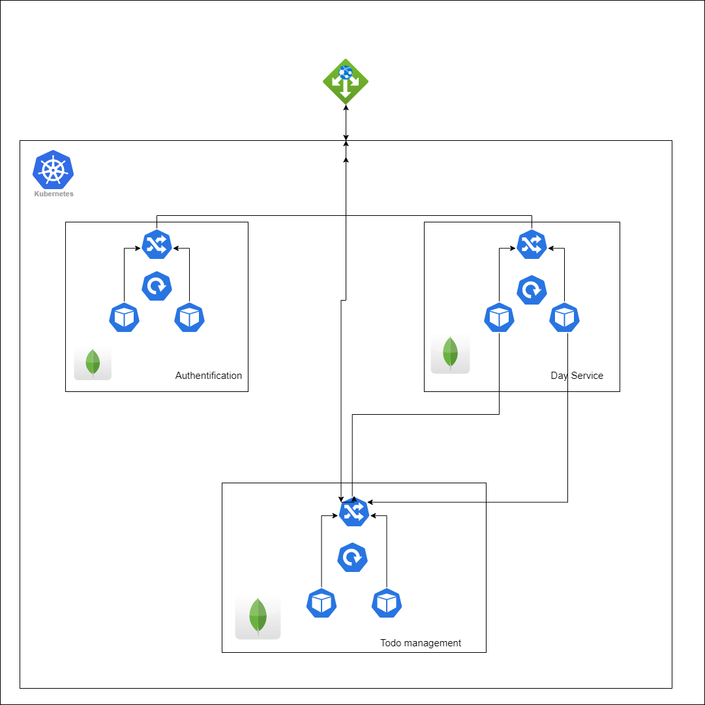

# Introduction
This project aims to deplaoy a set of microservices using IaC with different tools for :
1. Observability
2. Automation
3. Deployment

Infrastructure as Code (IaC) is the managing and provisioning of infrastructure through code instead of through manual processes. With IaC, configuration files are created that contain your infrastructure specifications, which makes it easier to edit and distribute configurations.

# Microservices
This application is a part of a Task management application , where users can get and save their tasks for a specific day.
The application is composed of 3 microservices: An authentication service and a Day Management service and a task management Service communicating with a MongoDb Database.

# Observability
In this part, we test how our systems works by observing what the services expose such as metrics, logs and traces.

## 1 - Metrics
I used Prometheus to collect metrics from Node JS apps with the use of Prometheus Client that helps you to get metrics from the endpoint `/todo/metrics` then we can use Grafana to visualize the metrics stream in real-time a time series database. We used it to Visualize the incoming requests to the said enteries

## 2 - Logs
I implemented a logging functionality with is a Library for NodeJS that is widely used for creating structured logs in different formats(such as file, console or even sending logs through HTTP).
For log collection, DataDog was the primary choice as it allowed an intuitive User Interface and setting the agent was fairly simple as it was packaged in a Helm Chart with basic configuration.

# Deployment
## Infrastructure
For each microservice we have a deployment that contains a numbre of replicas (2) an ingress controller for the incoming requests

# Automation
To automate the deployment of the application inside an Azure Kubernetes Cluster, I chose to use Terraform to install resources in the cluster and manage the interconnected systems within it. I decided to create stacks for the steps needed to run the application with its internal and external functionalities. The stacks are as follows:
1. Azure Kubernetes Cluster Provisioning
2. Application Deployment (microservices and ingress controller)
3. Observability tools Deployment

# Contibuting
This project is part of an academic course. Any Pull Requests are welcome.

